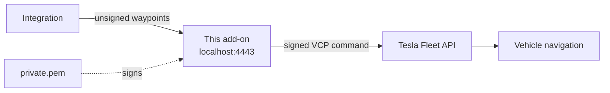

# Tesla Smart Routes Add-on

[](https://github.com/Briochorama/tesla-smart-routes-addon/releases)
[](LICENSE)

Home Assistant add-on that runs the Tesla Vehicle Command Protocol (VCP) HTTP proxy. Required by the **[Tesla Smart Routes integration](https://github.com/Briochorama/tesla-smart-routes)** to send navigation commands to Tesla vehicles.

---

## Why is this needed?

Since 2023, Tesla requires all vehicle commands to be cryptographically signed with an EC private key that you register with Tesla. This proxy sits between Home Assistant and the Tesla Fleet API. It receives unsigned commands and signs them before forwarding.



The proxy runs entirely on your Home Assistant host with no cloud dependency.

---

## Installation

### Step 1: Add custom repository

1. In Home Assistant: **Settings > Add-ons > Add-on Store**
2. Click the three-dot menu and select **Repositories**
3. Add: `https://github.com/Briochorama/tesla-smart-routes-addon`
4. Close. The **Tesla HTTP Proxy** add-on will appear in the store.
5. Click it and install.

### Step 2: Generate your Tesla key pair

You need to generate an EC key pair and register the public key with Tesla. This is a one-time setup.

**Requirements:** `openssl` (available on Linux/macOS/WSL; on Windows, install [OpenSSL for Windows](https://slproweb.com/products/Win32OpenSSL.html))

```bash
# Generate EC private key (prime256v1 = secp256r1)
openssl ecparam -name prime256v1 -genkey -noout -out private.pem
openssl ec -in private.pem -pubout -out public.pem
```

> **Keep `private.pem` secret.** It gives control over your vehicle commands. Never share it or commit it to version control.

### Step 3: Host the public key

Tesla fetches your public key from a URL you control. The simplest option is GitHub Pages:

1. Create a GitHub repo named exactly `<yourusername>.github.io`
2. Add the file at `.well-known/appspecific/com.tesla.3p.public-key.pem` with the contents of your `public.pem`
3. Add a `_config.yml` at the root:
   ```yaml
   include: [.well-known]
   ```
4. Add an empty `.nojekyll` file at the root
5. Enable GitHub Pages (Settings > Pages > Deploy from branch: `main`)

Your public key will be available at:
```
https://<yourusername>.github.io/.well-known/appspecific/com.tesla.3p.public-key.pem
```

### Step 4: Register your domain with Tesla

Register the domain where your public key is hosted using the `vehicle-command` CLI:

```bash
tesla-control -key-file private.pem register -domain <yourusername>.github.io
```

Or via a direct API call with a partner token:
```bash
curl -X POST https://fleet-api.prd.eu.vn.cloud.tesla.com/api/1/partner_accounts \
  -H "Authorization: Bearer <partner_token>" \
  -H "Content-Type: application/json" \
  -d '{"domain": "<yourusername>.github.io"}'
```

### Step 5: Copy the private key to Home Assistant

Copy your `private.pem` to the Home Assistant config folder at this exact path:

```
config/tesla_smart_routes/private.pem
```

On HAOS with Samba enabled, this is accessible via the **config** share:
```
\\<ha-ip>\config\tesla_smart_routes\private.pem
```

Create the `tesla_smart_routes` folder if it does not exist.

### Step 6: Pair the key with your vehicle

This step requires you to be **physically inside the vehicle** with your **Tesla key card**.

1. On your phone, open this URL in the Tesla app (not a browser):
   ```
   https://tesla.com/_ak/<yourusername>.github.io
   ```
2. Select the vehicle to pair
3. Follow the on-screen instructions. You will need to tap your key card on the center console to confirm.

This must be repeated for each vehicle.

### Step 7: Start the add-on

1. Go to **Settings > Add-ons > Tesla HTTP Proxy**
2. Click **Start**
3. Check the **Log** tab. You should see:
   ```
   [tesla-proxy] Starting proxy on port 4443...
   ```

---

## Configuration

No configuration options. The add-on reads the key from `/config/tesla_smart_routes/private.pem` and starts the proxy on port **4443**.

Make sure the add-on is set to **Start on boot** so it restarts automatically with Home Assistant.

---

## After installation

Install and configure the **[Tesla Smart Routes integration](https://github.com/Briochorama/tesla-smart-routes)**.

When prompted for **Proxy URL**, use:
```
https://localhost:4443
```

---

## Technical notes

- The proxy is built from [teslamotors/vehicle-command PR #443](https://github.com/teslamotors/vehicle-command/pull/443), which implements the `navigation_waypoints_request` VCP command (not yet merged into main)
- A self-signed TLS certificate is generated automatically on first start and stored in the add-on data folder
- The integration sets `ssl=False` for the local connection. This is expected and intentional.
- The proxy binds on `0.0.0.0:4443` and is only accessible within the Home Assistant internal network

---

## License

MIT. See [LICENSE](LICENSE)
